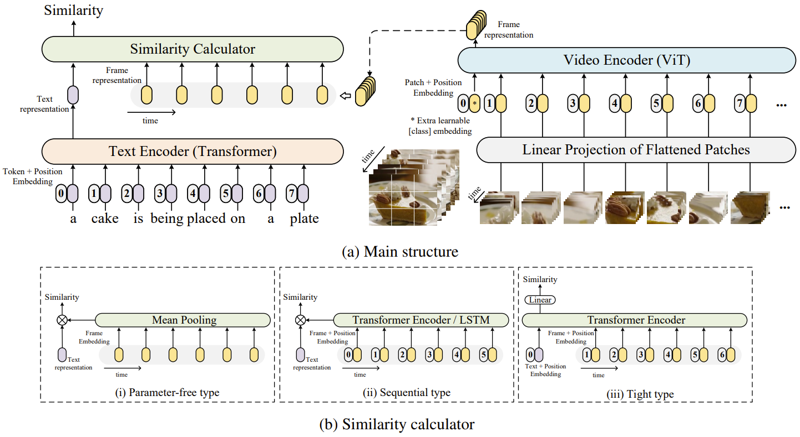
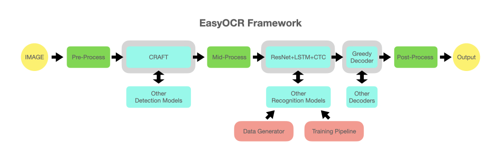

# Лидеры Цифровой Трансформации 2024

*MISIS ITUT ITAM team*

Team Members:
1) **Егор Чистов** - Backend
2) **Дмитрий Коноплянников** - Frontend
3) **Анна Гулякина** - Design
4) **Кирилл Рыжичкин** - ML Engineer
5) **Артём Плужиников** - ML Engineer

Презентация: [link](https://www.google.com/)

Веб-сервис: [itutitam.ru](https://www.google.com/)

API: [itutitam.ru/api/](https://www.google.com/)

## Кейс "Сервис текстового поиска по медиаконтенту" (Yappy)

> В библиотеке Yappy десятки миллионов коротких видео. Возможность быстро и эффективно находить интересующий контент улучшает пользовательский опыт, помогает найти новые интересы пользователя и улучшить рекомендации. Разработайте сервис, позволяющий индексировать и осуществлять поиск по видео на основе медиаконтента. Сервис должен уметь обрабатывать запросы пользователей, извлекать из них ключевые слова и на их основе осуществлять поиск релевантных видеофайлов.

## Предложенное решение

### Принцип работы системы изображен на блок-схеме: 

<тут будет блок-схема>

### Для извлечения фичей из видео использовались следующие подходы:
1) __CLIP__ (а именно *Searchium-ai/clip4clip-webvid150k*, обученный на парах "поисковый запрос - видео") - строим эмбеддинги видео (пространство этих эмбеддингов устроено так, что в нём векторные представления близких текстов и видео тоже близки, то есть эмбеддинги слова "кот" и видео с котом будут иметь высокие показатели близости, а это именно то, что нам и надо)

3) __OCR + Text Embedding__ - извлекаем текст из видео с помощью *EasyOCR* (каждые 3 секунды, чтение текста по фреймам распараллелено, это позволило значитель повысить скорость обработки одного видео), далее строим эмбеддинг текста с помощью *all-MiniLM-L6-v2*, это позволяет работать с видео, характерными для формата Yappy и Tiktok - когда на фоне просто нарезка каких-то фрагментов из игр или фильмов, а основная информация содержится в тексте, наложенном на видео

5) __VAD + ASR + Text Embedding__ - используем *silero-vad* для нахождения фрагментов аудиодорожки видео с голосом, транскрибируем с помощью *whisper-medium*, далее строим эмбеддинг текста с помощью *all-MiniLM-L6-v2*, это позволяет работать с видео, в которых основная информация содержится в их аудиосоставляющей


### Замеры скорости на видео длительностью 25 секунд:

<div align="center">
   
| Модель          | Время GPU (s) | Время CPU (s) |
|-----------------|-----------------|-----------------|
| [clip_model.py](https://github.com/l1ghtsource/lct-hack-yappy-2024/blob/main/ml/clip_model.py)   | 4.3             | 7.5             |
| [whisper_model.py](https://github.com/l1ghtsource/lct-hack-yappy-2024/blob/main/ml/whisper_model.py)| 2.68 (medium)   | 6 (base)        |
| [ocr_model.py](https://github.com/l1ghtsource/lct-hack-yappy-2024/blob/main/ml/ocr_model.py)    | 2.23            | 21              |
| [meta_model.py](https://github.com/l1ghtsource/lct-hack-yappy-2024/blob/main/ml/meta_model.py) (объединяет в себя все прошлые пункты)   | 8               | 32              |

</div>

### Обработка поискового запроса:
1) __CLIP Embedding__ - строим с помощью *clip4clip-webvid150k* векторное представление поискового запроса для мэтчинга с CLIP-эмбеддингами видео
2) __Text Embedding__ - строим с помощью *all-MiniLM-L6-v2* векторное представление поискового запроса для мэтчинга с эмбеддингами видео (векторными представлениями текстов, полученных с OCR и ASR)
3) __Ranking__ - на основании полученных эмбеддингов переведенного поискового запроса и эмбеддингов видео, содержащихся в БД *Clickhouse*, проводим быстрый поиск top-k похожих видео с помощью *faiss*, также здесь автоматически рассчитываются веса OCR, ASR и CLIP, на основании количества слов, распознанных *Whisper* и *EasyOCR*

### Замеры времени:

<div align="center">
   
| Модель          | Время GPU (ms) | Время CPU (ms) |
|-----------------|-----------------|-----------------|
| [text2clip_model.py](https://github.com/l1ghtsource/lct-hack-yappy-2024/blob/main/ml/text2clip_model.py) (построение эмбеддинга)| 17           | 50             |
| [text2minilm_model.py](https://github.com/l1ghtsource/lct-hack-yappy-2024/blob/main/ml/text2minilm_model.py) (построение эмбеддинга)| 8   | 22        |
| [ranker.py](https://github.com/l1ghtsource/lct-hack-yappy-2024/blob/main/ml/ranker.py)<br>(включая перевод, построение эмбеддингов и сам поиск top-k при k=20)| 211               | 323              |

</div>

## Кластеризация или поиск видео по тематикам

Имея значительное количество строк в БД с эмбеддингами видео, захотелось провести их кластеризацию. К эмбеддингам *CLIP* были применены стандартизация, *PCA* с 50 главными компонентами, затем был использован алгоритм *hdbscan* непосредственно для кластеризации. Было получено 98 различных кластеров, содержащих внутри себя видео одной тематики, дальше кластерам были даны названия и была проведена их фильтрация. В итоге осталось 48 качественных кластеров. Таким образом, у пользователя помимо опции обычного поиска подходящих видео по его запросу появилась опция выбрать определенный кластер, внутри которого содержатся точно отобранные видео на одну определённую тематику, соответствующую названию кластера.

Код кластеризации: [clusterization.py](https://github.com/l1ghtsource/lct-hack-yappy-2024/blob/main/ml/clusterization.py)

Полученные кластеры: [final_clusters.csv](https://github.com/l1ghtsource/lct-hack-yappy-2024/blob/main/data/final_clusters.csv)

## Fine-tuning переводчика на собственном датасете

Перед нами встала проблема: использовать API Google Translator и других популярных переводчиков запрещено, а open-source решения, к удивлению, не справляются с простыми запросами. Например, на запрос "роблокс", все популярные модели с huggingface выдавали результат "robls" или "roblocks", а эмбеддинг этого слова в CLIP-пространстве был далек от непосредственно роблокса и близок к блокам, что портило поисковую выдачу. На запрос "райан гослинг" маленькими буквами модель вовсе давала ответ "I'll take care of you. I'll take care of you". Поэтому, из популярных под видео тэгов Yappy, а также некоторых добавленных слов был [собран](https://github.com/l1ghtsource/lct-hack-yappy-2024/blob/main/utils/generate_dataset_for_translator_tuning.py) небольшой датасет из 10000 русских слов, далее эти слова были переведены с помощью Google Translator на английский и на полученных парах слов была [дообучена](https://github.com/l1ghtsource/lct-hack-yappy-2024/blob/main/ml/translator_train.py) модель машинного перевода *Helsinki-NLP/opus-mt-en-ru*. Модель выбирали исходя из [бенчмарков](https://huggingface.co/spaces/utrobinmv/TREX_benchmark_en_ru_zh) по соотношению скорости и качества ru-en перевода.

Модель: https://huggingface.co/lightsource/yappy-fine-tuned-opus-mt-ru-en

Исходная модель для сравнения: https://huggingface.co/Helsinki-NLP/opus-mt-ru-en

## Kaggle ноутбуки

| Ноутбук                                           | Описание                                     |
|---------------------------------------------------|----------------------------------------------|
| [Ноутбук с OCR, ASR, CLIP, Ranker, кластеризацией и замерами времени](https://www.kaggle.com/code/l1ghtsource/yappy-hackathon/) | Включает основные классы и замеры времени на GPU и CPU. |
| [Ноутбук с файн-тюнингом переводчика](https://www.kaggle.com/code/l1ghtsource/transaltor-finetune/) | Предназначен для проведения файн-тюнинга переводчика на собственном датасете. |
| [Ноутбук с кластеризацией видео по лицам](https://www.kaggle.com/code/l1ghtsource/yappy-faces/) | Содержит код для кластеризации видео по лицам. |

### Пример поиска видео:

```python
import clickhouse_connect
from ml.ranker import SimilarityRanker

client = clickhouse_connect.get_client(host='91.224.86.248', port=8123) # подключение к БД, содержащей предрасчитанные эмбеддинги
TABLENAME = 'embeddings'

data = client.query_df(f'SELECT id, clip_emb, ocr_emb, whisper_emb, whisper_len, ocr_len FROM {TABLENAME}')
data = data.drop_duplicates(subset='id')

df = pd.read_csv('path-to-csv-with-links') # исходный CSV-файл, содержайщий ссылки на видео

ranker = SimilarityRanker(data, df)
res = ranker.find_top_k('бравл старс', k=10)
```

## Преимущества решения:
1) Быстрый поиск подходящих видео с помощью *faiss* (300ms на CPU, 200ms на GPU)
2) Извлекаем максимум информации: текст с видео (*EasyOCR*), текстовое представление аудиосоставляющей (*Whisper*), учитываем происходящее на видео (CLIP)
3) Автоматическое взвешивание суммы близостей по всем трём эмбеддингам в зависимости от количества распознанных слов *Whisper* и *EasyOCR* (то есть если *Whisper*'ом слов будет распознано мало - веса сместится на *CLIP* и *OCR*, и наоборот)
4) Возможность сортировки видео по тематикам (кластеризация по CLIP-эмбеддингам)
5) Мультиязычность
6) Скорость построения новых эмбеддингов и занесения их в *Clickhouse*-хранилище, на GPU за 5-25с (в зависимости от длины видео) будут получены транскрибация, текст с видео, построены три эмбеддинга и занесены в БД
7) Автопродолжение поискового запроса и автокорреция орфографических ошибок [TODO]
8) Поиск видео по персоналиям (будут найдены видео с конкретным человеком) [TODO]
9) Собственный переводчик, зафайнтюненный на корпусе из популярных в Yappy слов (верно интерпретируем слэнг-запросы)
10) Real-time голосовой ввод в поле поиска
11) Независимость от тегов и описания видео
